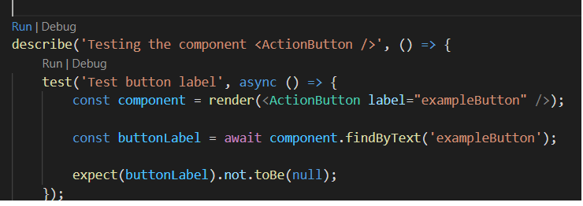
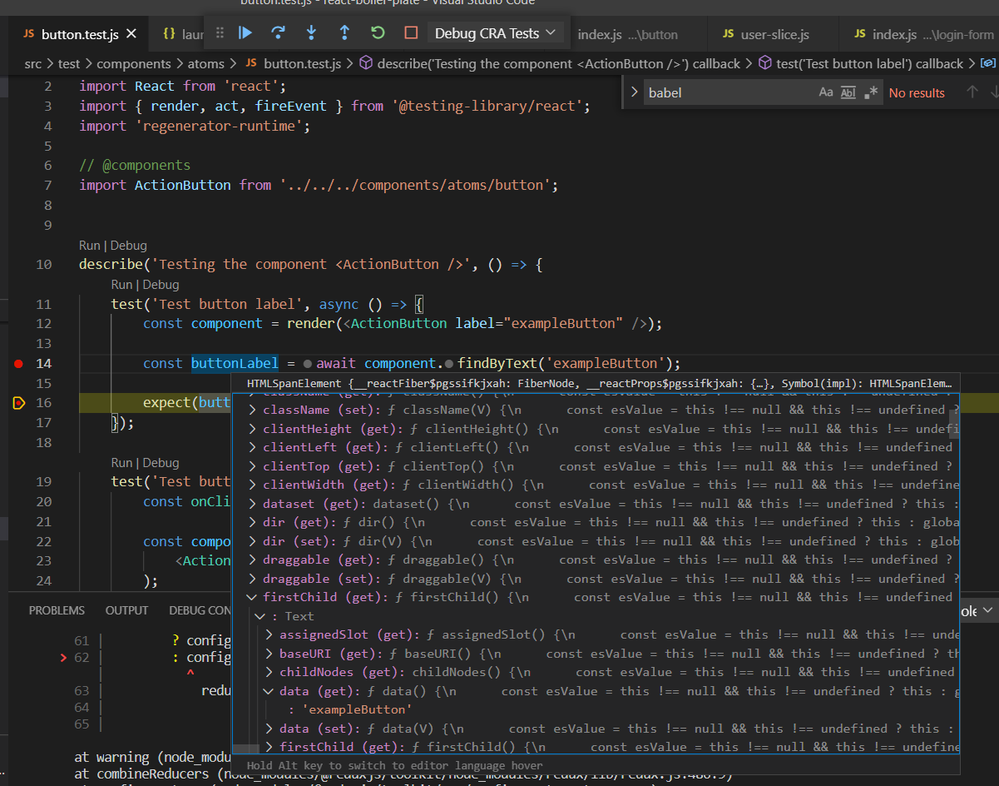

# GC React Boilerplate

The purpose of this repository is to provide a shell application for developing React Applications with most commonly needed steps to setup configuration, tests and redux middleware following the atomic design pattern for creating components.

### Installation

Download and clone this repository using

```
git clone https://github.com/mmctech/gc-react-boilerplate.git
```

Install dependencies with:

```
npm install
```

Finally, run this project using:

```
npm start
```

### Getting Started with Create React App

This project was bootstrapped with [Create React App](https://github.com/facebook/create-react-app).

#### Available Scripts

In the project directory, you can run:

#### `npm start`

Runs the app in the development mode.\
Open [http://localhost:3000](http://localhost:3000) to view it in the browser.

The page will reload if you make edits.\
You will also see any lint errors on the console.

#### `npm test`

Launches the test runner in the interactive watch mode.\
See the section about [running tests](https://facebook.github.io/create-react-app/docs/running-tests) for more information.

#### `npm run build`

Builds the app for production, copying the generated files to the `build` folder.\
It correctly bundles React in production mode and optimizes the build for the best performance.

The build is minified and the filenames include the hashes.\
Your app is ready to be deployed!

See the section about [deployment](https://facebook.github.io/create-react-app/docs/deployment) for more information.

#### `npm run eject`

**Note: this is a one-way operation. Once you `eject`, you can’t go back to automated config and tools like Webpack and Babel which comes through Create React App program!**

If you aren’t satisfied with the build tool and configuration choices with CRA (Create React App), you can `eject` at any time. When you run `npm run eject` command in your React application, you will be able to edit the configuration and script files. You also can upgrade or downgrade the dependencies version on the ejected `package.json` file. You will have to maintain your React app configuration on your own. This means:

- You need to update the dependencies and ensure its not broken when a new version is released
- If Create React App released a new version, you can’t update your application to the new version

#### Run in different environments

React Boilerplate has support for many different environments right now and running this project with ```npm start``` will only deploy a development version in your browser.

For reference, some environment variables are set up in start, start-mock and test scripts in ```package.json``` file.

```
"start": "cross-env DISABLE_ESLINT_PLUGIN=true REACT_APP_ENV=local npm-run-all -p start-js",
"start-mock": "cross-env DISABLE_ESLINT_PLUGIN=true REACT_APP_ENV=mock npm-run-all -p start-js",
"test": "cross-env REACT_APP_ENV=unitTest CI=true react-scripts test --setupFiles ./src/setup-tests.js --colors --env=jsdom --coverage"
```

##### **REACT_APP_ENV=local**

```npm start``` command will run the application with local environment and will retrieve all API values located in ```env-local.json``` file located at ```/config/setting```.

The name **'security'** in ```env-local.json``` file in first code snippet should  match with ```service.json``` file located at ```\config\services``` in second snippet.


```
"services": {
    "security": "http://localhost:8080"   
  },
```

``````
{
  "security": {
    "login": "{security}/login"
  }
}
``````

##### **REACT_APP_ENV=mock**

```npm run start-mock```  command will run the application with mock environment and will run with all set up in ```env-mock.json``` located at ```/config/setting```.

The name **'security'** in ```env-mock.json``` file in first code snippet should  match with ```service.json``` file located at ```\config\services``` in second snippet.

```
"services": {
    "security": "http://localhost:4001"   
  },
```

``````
{
  "security": {
    "login": "{security}/login"
  }
}
``````

To run a mock API backend at http://localhost:4001, you need to make sure that you mocking your API with a tool called **Prism**. For more information about it, please visit here: https://meta.stoplight.io/docs/prism/ZG9jOjk0-prism-cli

##### **REACT_APP_ENV=test**

``npm test`` command will run application will run the application using test parameters set up in ``env-unit-test.json``file.

The ``setup-test.js``, included in ``test`` script in ``package.json`` , includes ``serviceMocker`` which uses fake API call whenever any test runs on a piece of code, and it needs data from an actual backend API call. 

For running test set up, '**serviceMocker**' should include api call similar to '**mockLoginUser**'  in ```env-unit-test.json``` file shown in first code snippet which should match with '**mockedServices**' function in ```service-mocker.js``` located at ```\core``` shown in second snippet. The API call with '**config.services.security.login**' is located at ``\services\security`` shown in third snippet here:

```
"serviceMocker": {
    "delayResponse": 0,
    "isEnabled": true,
    "include": [      
      "mockLoginUser"
    ]
  },
```

``````
const mockedServices = {
    mockLoginUser: (mockAdapter) => {
        mockAdapter.onPost(
            format(
                config.services.security.login,
                config.settings.serviceMocker.loginUserName,
                config.settings.serviceMocker.loginPassword
            )
        ).reply(() => createMockResponse({
            data: config.mockData.security.user,
            httpCode: httpCodes.success
        }));
    },    
};
``````

```
class Security {
    static async login(user, password) {
        try {
            const data = await axios.post(
                format(config.services.security.login,
                    user,
                    password
                )
            );           
            return data;
        } catch (error) {
            globalUI.showAlertNotificationError(
                config.text.services.security.login,
                error.message
            );

            throw error;
        }
    }
}
```

##### Jest

Apart for above mentioned test setup, the default jest setup is also available to run any test. 

- To run any test, click on the ``Run`` button on any test file as shown in below screen-shot

  

  You will see in the terminal like``C:\react-boiler-plate>node "c:/react-boiler-plate/node_modules/jest/bin/jest.js" "c:/react-boiler-plate/src/test/components/atoms/button.test.js" -t "Testing the component <ActionButton />``

- To debug test with default CRA(Create React App) setup, follow below steps:

  1. Open launch.json file in VS code editor, and copy below listed code for debug configuration and save it.

     ```
     {
       "version": "0.2.0",
       "configurations": [
         {
           "name": "Debug CRA Tests",
           "type": "node",
           "request": "launch",
           "runtimeExecutable": "${workspaceRoot}/node_modules/.bin/react-scripts",
           "args": ["test", "--runInBand", "--no-cache", "--watchAll=false"],
           "cwd": "${workspaceRoot}",
           "protocol": "inspector",
           "console": "integratedTerminal",
           "internalConsoleOptions": "neverOpen",
           "env": { "CI": "true" },
           "disableOptimisticBPs": true
         }
       ]
     }
     ```
  
    2. Put the breakpoint in the code line which you want to inspect and hit ``debug`` button. It will ask to select debug config. Go to  Run in top menu and click 'open configuration' and select ``Debug CRA Tests`` which is saved in step 1. You will see orange strip in bottom as show. Clicking on it will start debugging.
  
       
  
    3. Debugger will stop at the breakpoint and you should be able to inspect an element or component.
  
       

If needed, you can change some of the following configurations in any ```env-{NAME}.json``` file located at ```/config/settings```

- Any of the backend API URL
- Service Mocker configuration (this config portion is only getting used while running application with mock env)
- Redux logger configuration

### Project Folder Structure

##### **package structure is as below:**

````makefile
```
src/
├─ components/
│  ├─ atoms/
│  ├─ molecules/
│  ├─ organism/
|  ├─ templates/
├─ config/
│  ├─ initial-state/
│  ├─ mock-data/
│  ├─ routes/
│  ├─ services/
│  ├─ settings/
│  ├─ text/
│  ├─ index.js
│  ├─ master-data/
├─ core/
│  ├─ ajax-interceptors.js
│  ├─ index.js
│  ├─ constants.js
│  ├─ global-ui.js
│  ├─ redux-store.js
│  ├─ service-mocker.js
├─ pages/  
├─ providers/
├─ reducers/
├─ services/
├─ shared/
├─ styles/
├─ test/
├─ util/
├─ app.js
├─ setup-test.js
├─ index.js
.babelrc
.env
.eslintrc
.gitgnores
atomic design pattern.md
Dockerfile
package-lock.json
react-0.3.1.tgz
package.json
README.md
```
````

##### root/:

- **.babelrc**: this file contains config for supporting ECMAScript 2015+ code into a backwards compatible version of JavaScript in current and older browsers or environments so that while running any test with **jest** can interpret the code in the test files.

- .**env**:  this file contains port and root folder name which will be used while deploying application in container, and all the src files will get added in the root folder name provided here under public folder.
- .**eslintrc**: This file contains the linter rules for the project, following the standards like airbnb
- .**gitgnore**: This file contains the files that are going to be ignored once a git operation is executed
- **atomic design pattern.md**: This file contains information about usability for atomic design structure in React application development. 
- **Dockerfile**: This file contains a basic docker configuration for running the application in a container
- **package-lock.json**: Describes the exact tree that was generated, such that subsequent installs can generate identical trees, regardless of intermediate dependency updates
- **react-0.3.1.tgz**: This file is a zip file for GCUI design library. To use this file, 
  1. add a dependency in package.json file. See ``"gcui": "file:react-0.3.1.tgz"`` in package.json
  2. import theme from``gcui`` parent component app.js. See ``import { theme } from 'gcui';`` in app.js.
- **package.json**: This file contains the dependencies installed, the scripts, and more info about the project

##### src/:

- **index.js**: It is the root of the application. The application starts from here. Add app.js as parent here. Wrap App component with Provider to use react redux store for state management.

- **app.js**: the ThemeProvider using theme from GCUI design library and BrowserRouter for having different routes in application should be wrapped around child components here. To  use GCUI Design library, follow below 2 steps:

  1. Go to this link https://guycarp.visualstudio.com/GC%20Design%20System/_git/components-react.
  2. Download the repo as zip and add it in the root folder. Please see ``react-0.3.1.tgz`` in folder structure above.	

- **setup-test.js**: Where the test configuration is done.

- **components/**: This folder contains all the components from the app. Inside this app, we implement a design pattern called atomic design, where we separate the content into other submodules like: 

  * **atoms/**:  Include tiny components with single element like buttons, inputs, texts, etc.

  * **molecules/**: Contains one to three components and joins them.

  * **organism/**: Combines atoms and or molecules. Also here is where part of the business logic is implemented.
  * **templates/:** Combines atoms, molecules and or organisms and shows final design layout.

  For more information about atomic design pattern, go to ``atomic design pattern.md`` in same project.

##### config/: 

	Contains all the needed configurations for the project. Inside the folder we find:

* **initial-state/**: all the initial states for the application are included herein JSON format. In the end, the JSON files are exported in a single index.js.
* **mock-data/**: the mock data for the responses or tests are inside in a JSON format and exported in an index.js.
* **routes/**: the routes for the project are included in a JSON file called routes.json. Then these routes are exported from the index.js file to be included in the routes.js file where the routes will be hired up with react-router.
* **services/**: the services like API connections, external servers, etc. Are included herein JSON format in services.json with api url and parameters and then to be exported into an index.js
* **settings/**: the configuration for the environment is included here where a default configuration for local, dev, prod, and unit-tests are made. The config for each file is made in JSON format where the mock services are declared, the API connections, etc.
 * **text/**: all the internationalization configuration is made here. Each language is put in a JSON file following this format: text-[code-language].js and it's exported from an index.js
 * **master-data/**: const variables, or data that's used through out the application several times it's included here, following a JSON format and then exported from an index.js file.
 * **index.js**: All the previous contents are exported from this file to be easy to access from different files and folders, and also to summarize the path when it's imported. So when you need to call any of the above services you just need to call this file.

##### core/: 

	This folder contains the core config for the project including the following structure:

* **ajax-interceptors.js:** the HTTP interceptors are included here, so any request or response is caught here before or after being received or sent.
* **constants.js:** constants values that are going to be used across the application are included here.
* **global-ui.js**: from this folder we can call any function or execute anything we want. For instance, it's included with an alert notification pop-up that can be used using globalUI.
* **redux-store.js**: all the redux store is configured here with their middlewares and extra config.
* **service-mocker.js**: the service mocker is configured inside an object of functions called: mockedServices. It is important to point out that the url for the services needs to match with the API call that we want to mock, otherwise the mock service is never going to be called.
* **index.js:** all the above files are exported from here to be simpler when importing the content.

##### pages/:

	This is the place where template instances are attached to the individual page.

##### providers/:

	The providers for managing the state are included here. Following this structure: 
	
	1) a folder with the name of the provider,
	2) a file inside that folder called actions.js which includes the actions to be executed, 
	3) an index.js where all the provider is configured and exported.

##### reducers/:

The reducers are inside this folder with its slice using redux toolkit,  which contains name, initial state, actions and extra reducers , naming each slice with a proper name that identifies it.

##### services/:

 All the API calls are included here. Commonly it's a static class with the functions inside, so when it's called from any place it's necessary to instantiate the class, just doing [NameOfTheClass].[NameOfTheFunction]. Alert notification from global-ui.js is added here to throw an error alert notification.

##### shared/:

contains hooks or some logic that can be used in many places across the app.

##### styles/:

Contains some files where some extra colors or fonts can be defined with GCUI design library.

##### test/:

All the testing for the application it's in this directory, from unit testing to complex integration tests. It's common to put the tests inside one folder that identifies the places which are being tested considering same atomic design package structure, and then the name of the file with the following structure: [NameOfTestFile].test.js

##### util/:

Common and helper functions are inside this folder such as date functions, DOM functions, number functions.

### Build

For building this code you can simply run

```
npm run build
```

This will generate your production files in ```./build``` folder. Then, you can use any HTTP server to see it or deploy it.

We suggest using npm ```http-server``` for checking the status of the build before deployment.

```
npx http-server ./build
```

### Docker

After the creationg of your ```build``` folder with ```npm start```, you can create and run Docker images with:

```
# Create new Docker Image
docker build -t $IMAGE_NAME .
docker run -it -rm -p $PORT_BIND:$PORT_LISTEN --name $NAME $IMAGE_NAME
```

For example:

```
docker build -t boilerplate .
docker run -it -p 3000:0 --name react-app boilerplate
```

### Avaliable Scripts

React Boilerplate has many other scripts that are pretty helpful for any Dev Team.

- ```lintj``` - You can use this for checking if any change in the code is syntactically correct according to the project's structure.

- ```test``` - this script is related to QA suite, it'll help you to run Unit Tests implemented for this project and collecting the coverage of the tested code.

- ```storybooks``` - This script will run a new server in ```localhost:6006``` with documentation related to components implemented in this project (Atoms, Organisms and Templates).
