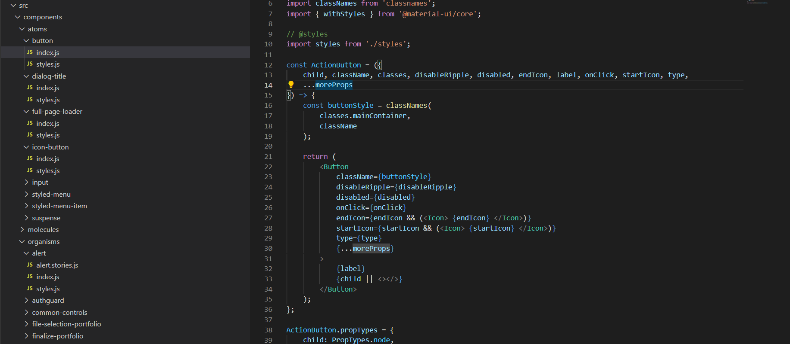
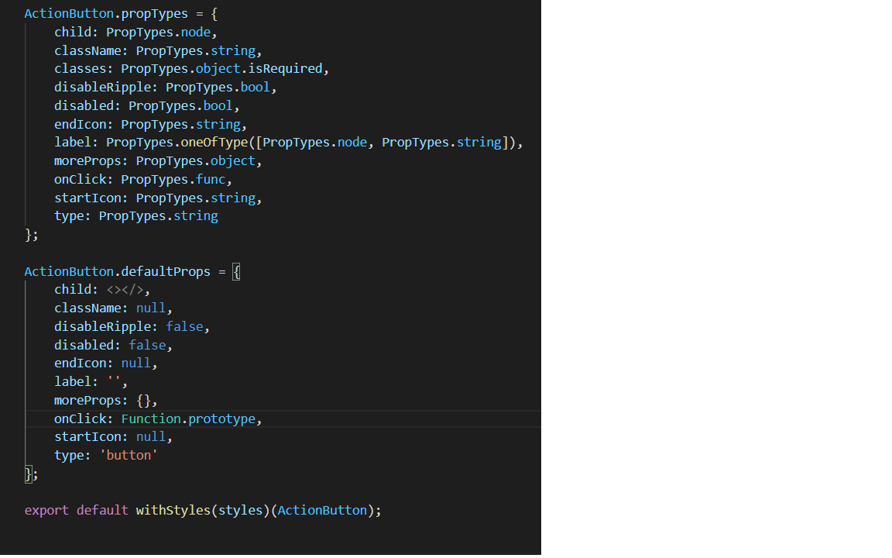

**The aim of the document is to help UI developers understand and discover a way to structure frontend React applications. Atomic design is a concept of breaking user interfaces into smaller and simpler elements which ultimately helps to create more consistent UI with better maintainability.**

#### Componentization in React

One of the exciting concepts that React has brought into the eco-system is 'componentization', which is encapsulating your designs as "components". React suggests you organize your applications by composing small bricks called "components".

##### Scenario

Let’s suppose you’re designing an activity feed for a social networking application. You’ve designed a “card” that represents a single item in the feed, but you want to verify that your design works at scale, given a sample set of data.

- Make a stateless functional component called `<Post>` that accepts one post as a property

```js
const Post = ({post}) => {
  return(
    <div className="bg-white ba b--black-10 pa3 mb3">
      <div className="flex">
        
        <div>
          <h1 className="f6 mv0 blue">{post.name}</h1>
          <ul className="mb0 mt1 pl0 list f6">
            <li className="dib black-50">{post.timeago}</li>
          </ul>
        </div>
      </div>
      <p className="f3 fw3 mv3">
        { post.status }
      </p>
    </div>
  )
}
```

- Make another stateless functional component called `<PostList>` that accepts an *array* of posts as a property and maps over it, returning individual `<Post>` components accordingly

```js
const PostList = ({posts}) => {
  return(
    <div>
      {
        posts.map((post) => {
          return <Post post={post}/>
        })
      }
    </div>
  )
}
```

- Render this parent component 'PostList' by feeding all the data as posts in React.

#### But Why Atomic Design?

When starting with a large React Single Page Application (SPA), there will be a need for lot of custom components to create. So the idea is to create these components by building them with HTML elements and using custom CSS. The concept of having one location with all the components and their CSS actually make development time faster.

By borrowing this terminology from Chemistry, Brad Frost introduced the Atomic Design concept and utilizing it with UI components makes sense. As the building blocks of websites are HTML elements and just like atoms these elements are combined together to form the complex pages. Each page designed by developers can be broken down into it’s smaller constituent components, similar to what is taught in Chemistry with molecules and organisms.

 


 

Atomic design is atoms, molecules, organisms, templates, and pages concurrently working together to create effective interface design systems.

- **Atoms** are the smallest possible components, such as buttons, titles, inputs, text. Atoms of our interfaces serve as the foundational building blocks of our components and can’t be broken down any further without ceasing to be functional. 

- **Molecules** as they are named consist of two or more atoms, molecules are relatively simple groups of UI elements functioning together as a unit. Examples are A Textfield comprising of an HTML textInput, a label, and an error message or a search Box comprising of an HTML TextInput and a Button. 

- **Organisms** are relatively complex UI components composed of groups of molecules and/or atoms and/or other organisms. These organisms form distinct sections of an interface.

- **Templates** place components within a layout and demonstrate the design’s underlying content structure. They are basically a skeletal structure of what the page would look like without the components of the page. 

- **Pages** are specific instances of templates that show what a UI looks like with real representative content in place. 

  Templates and Pages (pages are just instances of templates) also contain organisms, molecules, and atoms. The joining together of these smaller components makes up our user interfaces in our applications.
  
  
  
  

#### Benefits of Atomic Design in React

- Components can be developed separately from the application, tested and viewed on tools like a style guide before importing them into your application.
- No over-reliance on back-end application logic for starting front-end development.
- Once a set of patterns has been established, we can have a faster build process, with more flexibility in case a change needs to be made to the designs. 
- Designs can be more consistent since we are re-using a lot of existing components.
- Helps us manage our CSS a lot better since our CSS is tied to specific components. So depending on the architecture of your application you should only render the CSS utilized by the components rendered.

#### Example of adding single component in atoms



In above screen-shot, there is folder called button which is having index.js and styles.js files. index.js file contains the component and styles.js contains styling for a button component. The idea is to have a single button component in atoms and reuse it across the application by passing on all needed properties to the component by a parent component. That way we will not have any duplicate button element in the application anywhere.



It is always a good practice to add propTypes and defaultProps for each component for the ease of development. 

As you can see above, **styles.js** can be imported as '**import styles from './styles**' and '**import { withStyles } from @material-ui/core**' and then export with '**export default withStyles(styles)(ActionButton);**'. With this ActionButton is ready to be imported with '**import ActionButton from '../../atoms/button**'; in any component.
